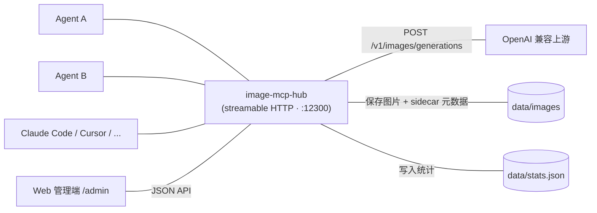

# image-mcp-hub

把 OpenAI 兼容的同步文生图接口（`/v1/images/generations`）转成 **MCP 工具**的 HTTP 中间层，用 Go 编写。一个常驻服务，供多个 agent 通过 [streamable HTTP](https://modelcontextprotocol.io/specification/2025-06-18/transports#streamable-http) 共用：一处配置、多处共享，Web 端改完即时生效，不断现有连接。

社区现有作品多为 stdio 传输——每个客户端各起一份进程、无法共享状态、改配置要重启客户端。本项目即为此而生。

## 特性

- **单端口多路径**：`/mcp`（MCP 端点）、`/admin`（Web 管理）、`/images/`（图片访问）共用一个 HTTP 服务
- **模型即工具**：每个配置的模型 = 一个 MCP tool，tool name 用自定义 alias，随时增删
- **参数透传**：`prompt`（必填）+ `size` / `n` / `quality` / `style` / `background` / `output_format`（可选）直接转发上游
- **`response_format` 不暴露**：中间层内部处理——上游返回 `url` 就下载、返回 `b64_json` 就解码，统一落盘，agent 永远拿到本地 URL
- **Key 轮询**：每个模型的 `api_keys` 列表 round-robin，游标持久化（重启接续）；错误原样上抛，不做失效标记
- **热加载配置**：`config.json` 由 Web 端改写即时生效（token、密码、清理规则、模型列表）；端口与存储目录需重启
- **Web 管理端**：中英双语、深浅主题、仪表盘（请求统计 / 趋势图 / 最近调用）、模型增删改查、图片浏览、全局设置
- **请求统计持久化**：`data/stats.json` 定期落盘，重启后累计数据不丢

## 架构



## 快速开始

```bash
go build -o image-mcp-hub .
./image-mcp-hub
```

首次运行会在当前目录生成默认 `config.json`：

```json
{
  "server":  { "host": "0.0.0.0", "port": 12300, "mcp_token": "sk-123456", "admin_password": "password" },
  "storage": { "dir": "./data/images", "max_age_days": 0, "max_count": 0 },
  "models":  []
}
```

- 管理界面: <http://localhost:12300/admin>（默认密码 `password`，**部署前务必修改**）
- MCP 端点:  <http://localhost:12300/mcp>（Bearer `sk-123456`，**部署前务必修改**）

在管理界面「模型」里添加模型（= 一个 MCP tool），填 alias / model_id / base_url / api_keys / 描述，即可被 agent 调用。

## 客户端接入

任意支持 MCP streamable HTTP 的客户端，把端点指向 `/mcp` 并带上 Bearer token 即可。

Claude Desktop（`claude_desktop_config.json`）：

```json
{
  "mcpServers": {
    "image-mcp-hub": {
      "type": "http",
      "url": "http://localhost:12300/mcp",
      "headers": { "Authorization": "Bearer sk-123456" }
    }
  }
}
```

Claude Code：

```bash
claude mcp add --transport http image-mcp-hub \
  --url http://localhost:12300/mcp \
  --header "Authorization: Bearer sk-123456"
```

> 若 hub 部署在反向代理之后，请使用代理地址，并确保代理转发 `Authorization` 头。

## 工具参数

每个模型暴露为一个同名的 MCP tool：

| 参数 | 类型 | 必填 | 说明 |
|------|------|------|------|
| `prompt` | string | ✅ | 提示词 |
| `size` | string | - | 尺寸，如 `1024x1024` |
| `n` | number | - | 生成图片数量 |
| `quality` | string | - | 生成质量 |
| `style` | string | - | 生成风格 |
| `background` | string | - | 图片背景 |
| `output_format` | string | - | 输出格式（png/jpg/webp…），同时决定本地文件扩展名 |

返回值：一个或多个**本地图片 URL**，形如 `http://host:12300/images/20060102-150405_uuid.png`，按行分隔。

## 端点

| 路径 | 说明 | 鉴权 |
|------|------|------|
| `/mcp` | MCP streamable HTTP 端点 | `Authorization: Bearer <mcp_token>` |
| `/admin` | Web 管理界面 | 密码登录（session cookie） |
| `/images/` | 图片访问，公开（UUID 防枚举） | 无 |

## 图片存储与清理

- 位置：`./data/images/`
- 命名：`20060102-150405_uuid.png`（时间戳精确到秒）
- 元数据：sidecar `20060102-150405_uuid.meta.json`（模型名 / prompt / 参数 / 时间 / 上游信息）
- 清理两条独立规则，满足任一即删，都关 = 永久留存（默认）：
  - `max_age_days`（0 = 不限时）
  - `max_count`（0 = 不滚动）

## Web 管理端功能

- 密码登录，默认 `password`（可改）
- **仪表盘**：请求总数 / 成功 / 失败 / 成功率 / 出图数，近 30 天趋势图，按模型成功率统计，失败原因 Top，最近调用记录（含耗时与错误），30 秒自动刷新
- **中英双语**：优先中文（浏览器为中文环境默认中文），顶栏一键切换，偏好持久化
- **深浅主题**：仅 light / dark，无自动模式；首次访问读取系统偏好，之后手动切换并持久化
- **模型管理**：增删改查（name / model_id / base_url / api_keys / description，描述带填写模板）
- **全局设置**：端口 / MCP token / 管理密码 / 清理规则 / 监听地址
- **图片浏览**：查看已生成图 + 元数据，可删除
- 无 emoji，内联 SVG 图标

> 端口与存储目录的修改需重启生效；MCP token、管理密码、清理规则、模型列表均为热加载。

## 配置字段

| 字段 | 说明 |
|------|------|
| `server.host` | 监听地址，`0.0.0.0` 对外开放 |
| `server.port` | 监听端口，默认 12300 |
| `server.mcp_token` | `/mcp` 端点 Bearer token |
| `server.admin_password` | `/admin` 登录密码 |
| `storage.dir` | 图片存储目录 |
| `storage.max_age_days` | 按时间清理，0 = 不限时 |
| `storage.max_count` | 按数量滚动清理，0 = 不滚动 |
| `models[].name` | 用户自定义 alias，作 MCP tool name（`^[a-zA-Z][a-zA-Z0-9_]{0,63}$`） |
| `models[].model_id` | 真实模型 id，转发上游时使用 |
| `models[].base_url` | 上游 OpenAI 兼容端点（含或不含 `/v1` 均可） |
| `models[].api_keys` | 该模型的 key 列表，round-robin 轮询 |
| `models[].key_index` | 轮询游标（持久化，重启后接续） |
| `models[].description` | Tool 描述，纯用户填写 |

## 安全说明

- **默认凭证仅用于本地体验**：`mcp_token` 与 `admin_password` 部署前必须修改
- **`config.json` 含明文 API key，已被 `.gitignore` 忽略**——切勿改动后提交到仓库
- `/images/` 无鉴权，仅靠 UUID 文件名防枚举；对公网部署建议在反向代理层加访问控制
- 建议在反向代理（Caddy / Nginx / Traefik）后启用 HTTPS 再对公网开放
- 上游 key 遇 401/403 等错误时原样上抛，**不会自动失效标记**，需在管理端手动调整

## 项目结构

```
main.go                     # 入口：路由、定时清理、统计落盘、优雅退出
internal/
  config/                   # config.json 加载 + 热重载 + key 轮询游标
  mcpserver/                # MCP 工具注册/调用、Bearer 鉴权、streamable HTTP
  upstream/                 # OpenAI 兼容上游客户端（url 下载 / b64_json 解码）
  storage/                  # 图片落盘、sidecar 元数据、清理规则
  stats/                    # 请求统计（内存 + data/stats.json 持久化）
  admin/                    # /admin/api/* JSON API、会话登录
  web/                      # 管理端 SPA（embed 打包进二进制）
```

## 开发

```bash
go test ./...      # 单元 + 集成测试（含 mock 上游全流程）
go vet ./...
go build -o image-mcp-hub .
```

环境变量 `IMAGE_MCP_HUB_CONFIG` 可指定配置文件路径。

## FAQ

**Q: 为什么改端口 / 存储目录要重启？**
A: 二者在进程启动时固定（监听地址、存储句柄）；token、密码、清理规则、模型列表走热加载，改完即时生效。

**Q: 上游不认识的参数会被怎样处理？**
A: 参数原样透传，上游忽略即可；`response_format` 由中间层接管，不会发给上游。

**Q: key 轮询到失效的 key 会怎样？**
A: 错误原样上抛给 agent，不做失效标记；可在管理端编辑模型替换 key。

**Q: 支持异步任务制的供应商吗？**
A: 不支持，仅同步 `generations`。上游返回 `url` 或 `b64_json` 两种形态都会被下载/解码为本地文件。

**Q: 统计和图片会随仓库推送吗？**
A: 不会。`data/`、`config.json`、`.obsidian/` 均已在 `.gitignore` 中排除。
